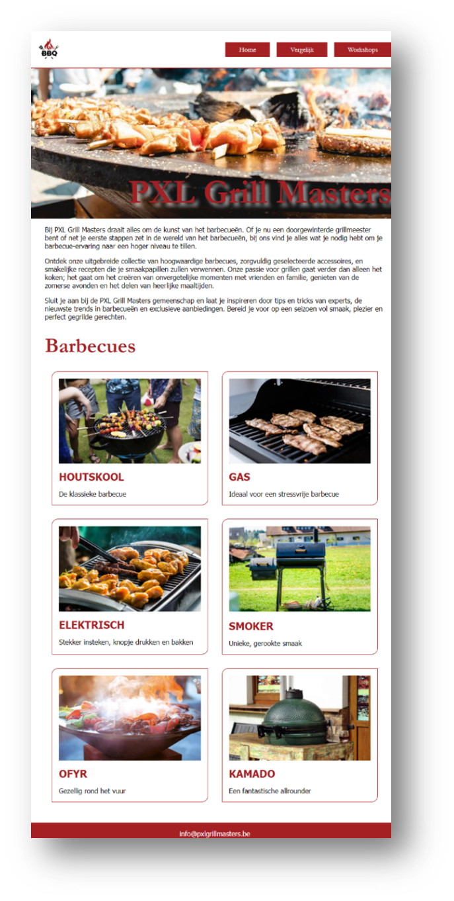
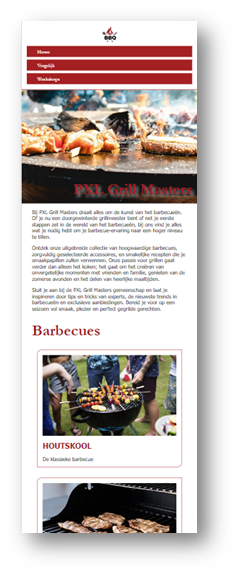
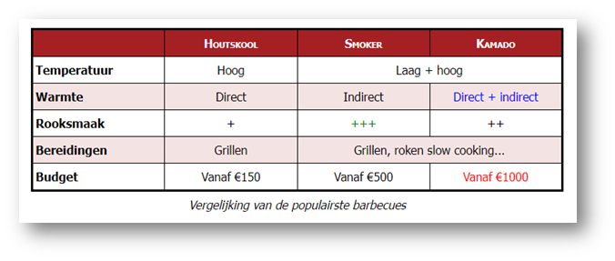
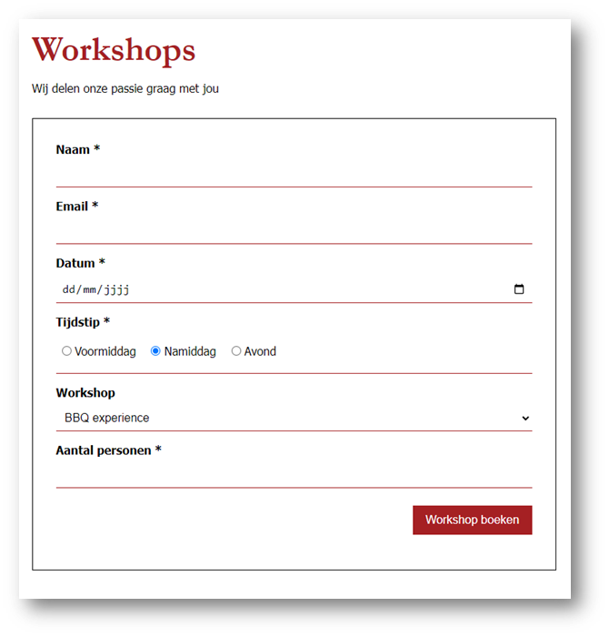
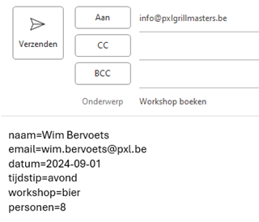

# PXL Grill Masters

## Algemene instructies
- Alle bestanden zijn reeds voor je aangemaakt. Deze bestanden mag je niet van naam en niet van plaats veranderen.
- De benodigde afbeeldingen vind je in de map ‘_assets’_.
- Alle stijleigenschappen komen in de externe CSS‑bestanden.
- De examens zullen verbeterd worden met behulp van Google Chrome. Controleer je werk dus ook in deze browser.

_OPGELET! Het niet volgen van bovenstaande instructies resulteert, per inbreuk, in puntenverlies!_

**_VEEL SUCCES!_**

## **Opdracht 1 (55 punten)**

Open de bestanden ‘index.html’ en ‘index.css’ in Webstorm. Volg onderstaande stappen en bekijk aandachtig de screenshots om te komen tot het nodige eindresultaat. **_Voor deze opdracht mag je geen tabellen gebruiken, indien je dit toch doet, worden de punten van deze opdracht gehalveerd!_**

**_Stap 1 – Meta-gegevens en linken_**

- De webpagina bevat alle nodige meta-gegevens en linken.
- De webpagina bevat de titel ‘Grill Masters’.

**_Stap 2 – CSS Reboot en algemene opmaak_**

- De HTML-elementen hebben standaard geen witruimte binnen het element.
- De HTML-elementen hebben standaard geen witruimte buiten het element.
- De volledige webpagina bevat de lettertypes ‘Tahoma’ en ‘sans-serif’.
- De randen en de witruimtes binnen de elementen worden meegerekend in de eventuele ingestelde breedtes van de HTML-elementen.

**_Stap 3 – De navigatiebalk_**

Voorzie een navigatiebalk bestaande uit een afbeelding en een lijst. Pas onderstaande opmaak toe door gebruik te maken van CSS-klassen. Gebruik hiervoor de namen navigation, navigation_\_list en navigation_\_list-item

- De navigatiebalk gebruikt CSS3 Flexbox om de inhoud te positioneren
- De inhoud van de navigatiebalk wordt verticaal gecentreerd
- Tussen de afbeelding en de lijst zit de overgebleven horizontale witruimte van de navigatiebalk.
- De navigatiebalk heeft
    - een volle rand onderaan van 2px in de kleur #A52023
    - 1rem witruimte binnen het element
- De afbeelding is aanklikbaar (dummy-link).
- De afbeelding is 50px hoog en breed.
- De navigatielijst aan de rechterzijde bevat 3 hyperlinks die staan gepositioneerd via CSS3 Flexbox.
    - De eerste (Home) bevat een dummy-link.
    - De tweede (Vergelijk) verwijst naar vergelijk.html en opent, na het klikken door de bezoeker, in een nieuw tabblad.
    - De derde (Workshops) verwijst naar workshops.html en opent, na het klikken door de bezoeker, in een nieuw tabblad.
- Alle hyperlinks in de lijst hebben:
    - Het lettertype Garamond en serif
    - 1rem witruime buiten het element aan de linkerzijde
    - Geen onderlijnde tekst
    - Geen opsommingstekens
    - De achtergrondkleur #A52023
    - Een witte (#FFFFFF) tekstkleur
    - 0.5rem witruimte binnen het element aan de boven- en onderkant
    - 2rem witruimte binnen het element aan de linker- en rechterkant
    - Een gele (#FFBD2E) tekstkleur wanneer de muis over de knop beweegt

**_Stap 4 – De header_**

Voorzie, onder de navigatiebalk, een header.

- De header is 350px hoog is en heeft een witruimte binnen het element van 1rem
- De afbeelding in de header is een achtergrondafbeelding genaamd ‘header.jpg’. De achtergrondafbeelding bedekt altijd de volledige header. De focus van de achtergrondafbeelding ligt rechts onderaan.
- De titel in de container staat gepositioneerd via CSS3 Flexbox en staat rechts onderaan in de header.
- De tekst van de titel is rood (#A52023), de lettergrootte is 6rem en het lettertype is Geramond en serif. Ten slotte wordt de titel in vette tekst weergegeven en heeft deze een schaduw van 0.5 rem in een witte, deels doorzichtige kleur. Gebruik hiervoor de rgb-waarde 255 255 255 met een alpha waarde van 0.6.

**_Stap 5 – De main_**

Voorzie, onder de header, een main structuur element met 2 containers. De eerste container bevat 3 paragrafen, de tweede container bevat een titel van niveau 2 en een lijst. Gebruik de CSS-klassen main_\_intro-container en main_\_bbq-container om de opmaak toe te passen:

- De main heeft een breedte van 70rem en staat horizontaal gecentreerd.
- Alle paragrafen in de eerste container hebben 1rem witruimte buiten het element aan de bovenzijde.
- De titel in de tweede container heeft:
    - Een tekstkleur #A52023, een lettergrootte van 3rem en het lettertype Geramond en serif
    - 2rem witruimte buiten het element aan de bovenzijde en 1rem witruimte buiten het element aan de onderzijde
- De lijst met categorieën heeft geen opsommingstekens, de inhoud wordt gepositioneerd met CSS3 Flexbox. De inhoud komt naast elkaar te staan en wordt automatisch op een nieuwe rij weergegeven wanneer nodig.
- Elke item in de lijst bevat 3 elementen die worden gepositioneerd met CSS3 Flexbox: een afbeelding, een titel van niveau 3 en een paragraaf.
- Daarnaast heeft elk item de volgende eigenschappen:
    - Een volle rand van 1px in de kleur #A52023
    - Een afgeronde rand van 15px in de linkerbovenhoek en de rechterbenedenhoek
    - Een breedte van 33% - 2rem
    - 1rem witruimte zowel binnen als buiten het element
- De afbeelding is steeds 100% breed
- De titel:
    - Heeft de tekstkleur #A52023
    - Heeft een lettergrootte van 1.5rem
    - Heeft 1rem witruime buiten het element aan de boven- en onderzijde
    - Wordt steeds in hoofdletters weergegeven

**_Stap 6 – De footer_**

Voorzie, onder de main, een footer.

- De footer heeft:
    - bovenaan een witruimte buiten het element van 2rem en een rode (#A52023) achtergrond.
    - 1rem witruime binnen het element
- De tekst in de footer staat, gebruik makend van CSS3 Flexbox, zowel horizontaal als verticaal gecentreerd en bevat een mailto-koppeling naar het e-mailadres ‘<info@pxlgrillmasters.be>’. De tekst is wit (#FFF) en er staat standaard geen lijntje onder. Enkel wanneer de bezoeker met de muis over de tekst gaat, komt er een lijntje onder te staan.

**_Stap 7 – Responsiviteit_**

Voorzie de nodige opmaak zodat de webpagina zich correct aanpast aan de breedte van het scherm. Bekijk ook zeker de screenshots om tot een correct resultaat te komen!

- Wanneer het scherm een breedte heeft < 75rem:
    - Heeft het main-structuur element een breedte van 100% en 2rem witruime binnen het element aan de linker- en rechterzijde
    - Heeft de titel in de header een lettergrootte van 5rem
- Wanneer het scherm een breedte heeft < 62rem:
    - Heeft een bbq-lijstitem een breedte 50% - 2rem
- Wanneer het scherm een breedte heeft < 48rem:
    - Heeft een bbq-lijstitem een breedte 100%
    - Heeft de titel in de header een lettergrootte van 4rem
- Wanneer het scherm een breedte heeft < 36rem:
    - Heeft de titel in de header een lettergrootte van 3rem
    - Worden alle elementen in de navigatiebalk onder elkaar weergegeven en heeft de lijst een breedte van 100%
    - Heeft een navigatielink 0.5rem witruimte buiten het element, enkel aan de bovenzijde

| Tablet                                           | Mobile                                            |
|--------------------------------------------------|---------------------------------------------------|
|  |  |

## **Opdracht 2 (22 punten)**

Open de bestanden ‘vergelijk.html’ en ‘vergelijk.css’ in Webstorm. Volg onderstaande stappen en bekijk aandachtig de screenshots om te komen tot het nodige eindresultaat. **Voor deze opdracht mag je geen classes of id’s gebruiken, indien je dit toch doet, worden de punten van deze opdracht gehalveerd!**

**_Stap 1 – Meta-gegevens en linken_**

- De webpagina bevat alle nodige meta-gegevens en linken.
- De webpagina bevat de titel ‘Barbecues’.

**_Stap 2 – CSS Reboot en algemene opmaak_**

- De HTML-elementen hebben standaard geen witruimte binnen het element.
- De HTML-elementen hebben standaard geen witruimte buiten het element.
- De volledige webpagina bevat de lettertypes ‘Tahoma’ en ‘sans-serif’.
- De randen en de witruimtes binnen de elementen worden meegerekend in de eventuele ingestelde breedtes van de HTML-elementen.

**_Stap 3 – De tabel_**

Voorzie in de main een tabel met een thead en tbody.

- De eerste rij staat in de thead, de overige rijen in de tbody
- Sommige cellen zijn horizontaal samengevoegd.
- Zowel de eerste rij als de eerste kolom van de tabel bevat enkel header cellen
- Zorg dat de tabelbeschrijving onder de tabel wordt weergegeven
- De tabel is 720px breed, heeft boven en onder een witruimte buiten het element van 80px en staat horizontaal in het midden van de webpagina.
- Alle kolommen in de tabel zijn exact even breed.
- De buitenste rand van de tabel is een volle zwarte (#000) rand van 3px.
- De individuele cellen hebben een volle zwarte (#000) rand van 1px en een witruimte binnen het element van 0.5rem verticaal en 0.2rem horizontaal. Tussen de cellen zit geen spatie of witruimte.
- De tabelbeschrijving heeft 0.5rem witruimte binnen het element en wordt cursief weergegeven
- Cellen in de thead:
    - Hebben een rode (#A52023) achtergrond
    - Hebben een witte (#FFF) tekstkleur
    - Worden in small-caps weergegeven
- De tekst in de cellen van de eerste kolom wordt links uitgelijnd
- De tekst in de overige cellen van de tbody wordt gecentreerd
- Cellen in de even rijen van de tbody krijgen de achtergrondkleur #A5202320
- In rij 2,3 en 5 krijgt telkens één bepaalde cel een andere tekstkleur (blue, green en red)

 ## **Opdracht 3 (23 punten)**

Open de bestanden ‘workshop.html’ en ‘workshop.css’ in Webstorm. Volg onderstaande stappen en bekijk aandachtig de screenshots om te komen tot het nodige eindresultaat. **Voor deze opdracht mag je geen tabellen gebruiken, indien je dit toch doet, worden de punten van deze opdracht gehalveerd!**

**_Stap 1 – Meta-gegevens en linken_**

- De webpagina bevat alle nodige meta-gegevens en linken.
- De webpagina bevat de titel ‘Workshops’.

**_Stap 2 – CSS Reboot en algemene opmaak_**

- De HTML-elementen hebben standaard geen witruimte binnen het element.
- De HTML-elementen hebben standaard geen witruimte buiten het element.
- De volledige webpagina bevat de lettertypes ‘Tahoma’ en ‘sans-serif’.
- De randen en de witruimtes binnen de elementen worden meegerekend in de eventuele ingestelde breedtes van de HTML-elementen.
- De main is 720px breed. De main heeft boven en onder een witruimte buiten het element van 80px en staat horizontaal in het midden van de webpagina.
- De titel van niveau 1 is rood (#A52023), heeft een lettergrootte van 3rem en heeft een lettertype ‘Garamond’ en ‘serif’
- De paragraaf onder de titel heeft bovenaan 1rem en onderaan 2rem witruimte buiten het element.

**_Stap 3 – Het contactformulier_**

Voorzie een contactformulier met verschillende type invoervelden, labels en knoppen.

- De labels en de invoervelden zijn, waar mogelijk, aan elkaar gelinkt.
- De invoervelden met een sterretje zijn verplicht in te vullen.
- De radiobuttons vormen één geheel, bevinden zich in een fieldset en bevatten volgende waarden:
    - voormiddag
    - namiddag (standaard geselecteerd)
    - avond
- De keuzelijst bevat volgende waarden en teksten:
    - Bbq: BBQ experience
    - Bier: Bier & BBQ workshop
    - Wisky: Wisky & BBQ workshop
    - Ofyr: Ofyr experience
    - Egg: Big green “eggperience”
- Workshops worden enkel gegeven aan groepen van 4 tot 12 personen
- Bij het klikken op de knop ‘Workshop boeken’ opent de standaard mailcliënt op de computer. De mail met de ingevulde gegevens wordt opgemaakt voor ontvanger ‘<info@pxlgrillmasters.be>’ en heeft als onderwerp ‘Workshop boeken’. Alle ingevulde gegevens staan in de mail onder elkaar als platte tekst.

**_Stap 4 – De opmaak van het contactformulier_**

- Het formulier staat in de main van de webpagina, heeft een volle zwarte rand van 1px en heeft 2rem witruimte binnen het element
- Alle elementen van het formulier worden onder elkaar weergegeven door middel van CSS3 Flexbox
- De tekst van bijna alle labels staat in het vet.
- De input- en selectelementen en de fieldset hebben:
    - 0.5rem boven en 1rem onder witruime buiten het element
    - 0.5rem witruimte binnen het element
    - Enkel onderaan een rode (#A52023) volle rand van 1px
    - Een lettergrootte van 1rem
- De labels van de radiobuttons staat niet in het vet en hebben 1rem witruimte aan de rechterzijde buiten het element
- Gebruik de attribuut-selector voor het submit-element en zorg ervoor dat dit element:
    - Een breedte van 25% heeft
    - Zichzelf rechts uitlijnt
    - 0.5rem witruimte binnen het element heeft
    - Een rode (#A52023) volle rand van 3px heeft
    - Een rode (#A52023) achtergrondkleur heeft
    - Een witte (#FFF) tekstkleur heeft
    - Een gele (#FFBD2E) tekstkleur krijgt wanneer de muis over het element beweegt